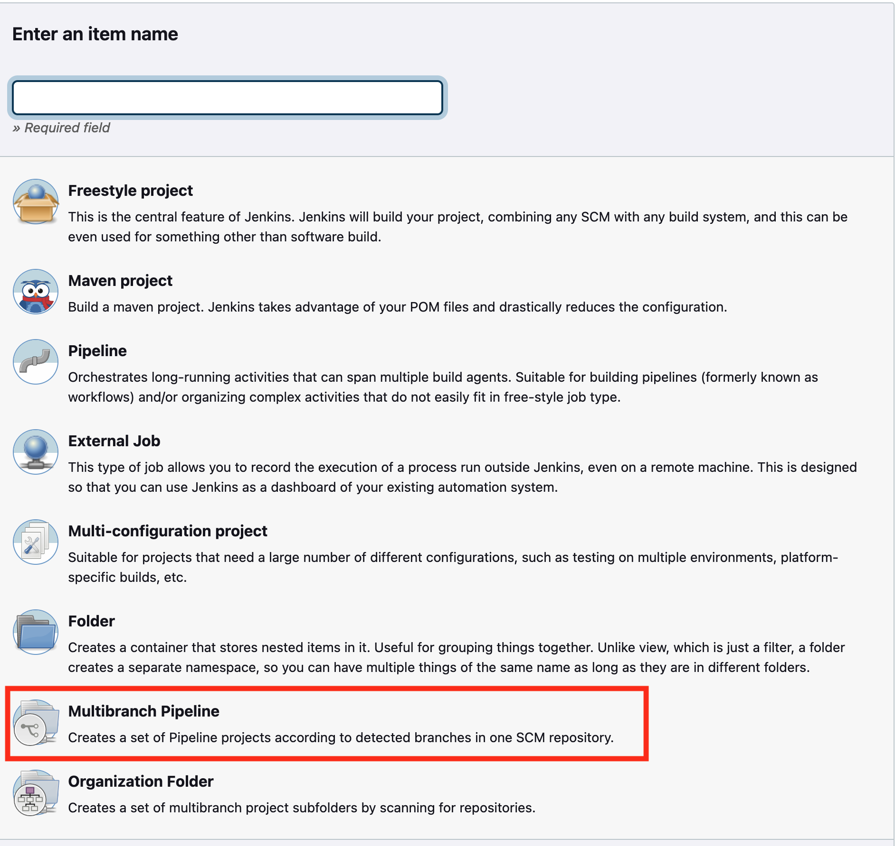
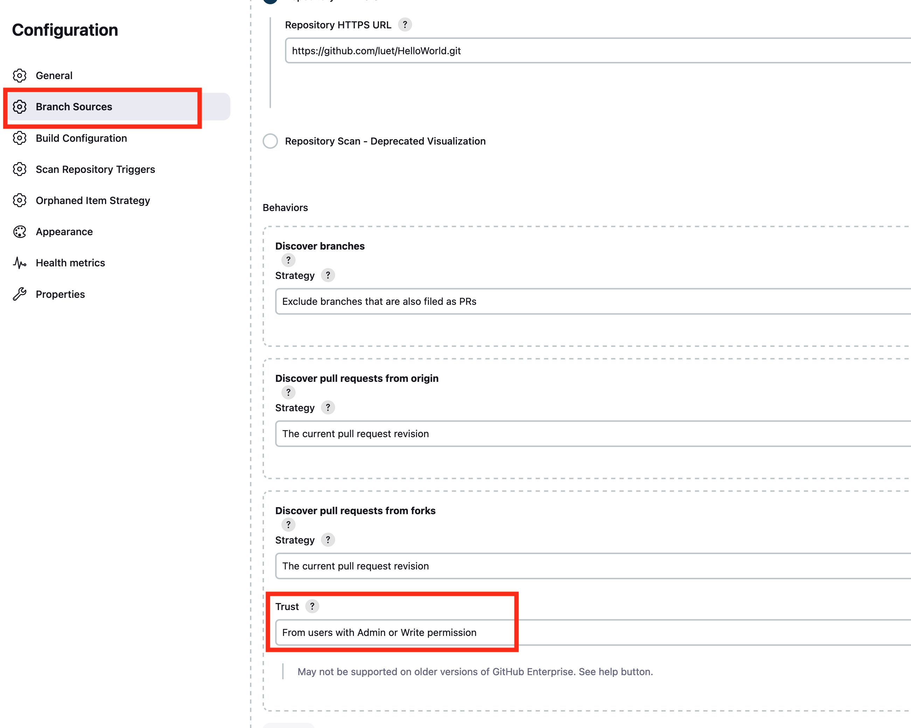

Table of Contents
- [Introduction](#introduction)
- [Using the plugin](#using-the-plugin)
- [Secure your checks](#secure-your-checks)


# Introduction
The plugin [GitHub Branch Source](https://docs.cloudbees.com/docs/cloudbees-ci/latest/cloud-admin-guide/github-branch-source-plugin) can be used as a replacement for the [GitHub Pull Request Builder](https://plugins.jenkins.io/ghprb/) that is being deprecated. It can do a lot more than pull-requests trigger. It lets you build pipelines. One interesting feature of this plugin is that you can define the configuration of the Jenkins job in a file called `Jenkinsfile` that is committed in the Git repository.

# Using the plugin
To be able to use the `GitHub Branch Source` plugin, you need to select `Multibranch Pipeline` project type when you create a new project:


This is a good tutorial to get started with the `GitHub Branch Source`: [How to Create a GitHub Branch Source Multibranch Pipeline in Jenkins](https://www.youtube.com/watch?v=aDmeeVDrp0o)

This is a template for the `Jenkinsfile` that is used in the tutorial. Note that you will need to replace `adroit_luet` by your agent on the Jenkins server:

```
pipeline {
    agent { label "adroit_luet"}
    options {
	buildDiscarder logRotator(artifactDaysToKeepStr: '', artifactNumToKeepStr: '5', daysToKeepStr: '', numToKeepStr: '5')
    }
    stages {
	stage('Hello') {
	    steps {
		sh '''
                java -version
                '''
		echo "hello"
	    }
	}
	stage ('for the fix branch') {
	    when {
		branch "fix*"
	    }
	    steps {
		sh '''
            cat README.md
        '''
	    }
        }
	stage ('For the PR') {
		when {
			branch 'PR-*'
		}
		steps {
			echo 'this is only for the PRs'
		}
	}
    }
}
```
# Secure your checks
If your repository on GitHub is public, you need to restrict who can trigger a Jenkins check otherwise someone could run malicious code on your Jenkins agent. At the time of this writing, we have not tested with this feature but we believe that setting up the `Discover pull requests from forks >> Trust` to `From users with Admin or Write permission` should protect your branch:
