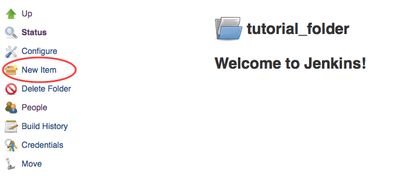
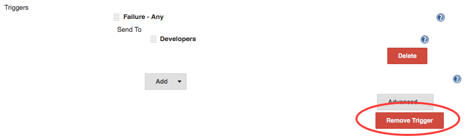
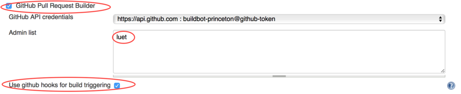

# Table of Contents

1.  [Automatic Testing with Jenkins](#orga7036b9)
2.  [Your Internet Connection](#org41edd65)
3.  [Credentials for the Agent Node, GitHub and Jenkins](#orgede9452)
    1.  [GitHub Setup](#orgcda9488)
        1.  [Clone the Tutorial Repository on GitHub](#org61129bb)
        2.  [Add buildbot-princeton as a collaborator](#org04bfd89)
        3.  [Generate the ssh public and private keys](#orgc872b45)
        4.  [Copy the public key to your GitHub account](#org7d4ffc1)
        5.  [Copy the private key on your Jenkins account](#org97809db)
    2.  [Agent Node Configuration](#org2c56588)
4.  [Setting Up A Build in Jenkins](#org42b890c)
    1.  [Creating a Simple Build with Manual Trigger](#orgfacc8d4)
        1.  [Project Identity And Build Rotation](#org20eb461)
        2.  [Agent Node](#org2440717)
        3.  [Source Code Management (Git)](#org52ba0f2)
        4.  [Add a test](#org6bd16ce)
        5.  [Add e-mail notifications](#orgd46d47f)
    2.  [Automatically Trigger A Build When Someone Opens a Pull-Request](#org1f19f0a)
        1.  [Changes on the Jenkins Server](#orgeaad92b)
        2.  [Changes on GitHub](#orgd51e9d4)
        3.  [Open a Pull-Request To Test the New Settings](#org868db87)

# Automatic Testing with Jenkins

The system for automatic testing involves three components:

1.  the source code, it usually comes from a **Source Control Management (SCM)** system, which is either git or subversion.
2.  the computer where the tests are run, this is called the **agent node**.
3.  the Continuous Integration server, which is the **Jenkins server**.

A typical sequence of events for a build is:

1.  a code change is pushed by a developer to the SCM repository.
2.  the SCM system sends a message to the Jenkins server saying that something has changed.
3.  Jenkins starts running a test, this is called a **build** by:
    1.  fetching the changes from the SCM repository.
    2.  running the tests on the agent nodes
    3.  notifying the developers of the results of the tests.

The goal of this tutorial is to demonstrate how to configure the different components to set up a test.
We will use a Python code, available on GitHub, to define some simple tests.
So the SCM system for this tutorial is git on GitHub.

First we will check that you can connect to the Jenkins server in Section [2](#orgabceb43).
Then in Section [3](#orgb31abbe) we will configure the authentication between the three components of the testing system&#x2014;GitHub, the agent nodes and the Jenkins server&#x2014;so they can communicate with each other.
In Section [4](#org001f92d) we go through the steps to configure a build.

Throughout this tutorial, the figures are scaled to fit on the current screen, if you need a larger figure, you can usually right click on it and choose `Open Image in New Tab` or `Open Image in New Window`.

# Your Internet Connection

For security reasons, the [Jenkins server](https://jenkins.princeton.edu) is only accessible when your computer is connected to the campus network or when using a VPN like [GlobalProtect](https://princeton.service-now.com/service?sys_id=KB0012373&id=kb_article).

# Credentials for the Agent Node, GitHub and Jenkins

## GitHub Setup

### Clone the Tutorial Repository on GitHub

To follow this tutorial, you need an account on [GitHub](https://github.com/). You then need to fork the repository for the code used in this tutorial on your GitHub account. To do so:

-   Go to the repository for the tutorial:
    <https://github.com/PrincetonUniversity/jenkins_tutorial>
-   and click `Fork`
    
    

-   This will create a repository on <https://github.com/GitHubID/jenkins_tutorial>, where you should replace `GitHubID` by your GitHub ID.

### Add buildbot-princeton as a collaborator

You need to add the GitHub user "buildbot-princeton", which is the GitHub id for Jenkins at Princeton, as a collaborator to your fork. This explains how to do it:
[Adding collaborators to a personal repository](https://help.github.com/articles/adding-collaborators-to-a-personal-repository/)

It is recommended that you give `buildbot-princeton` push (or write) access. We will talk about why later. 

Your `Collaborators` and page on GitHub should look like this:

### Generate the ssh public and private keys

Now we are going to give the Jenkins server access to this GitHub repository using an ssh public/private key pair.

-   Create a ssh public/private key pair on any machine that you have access to.
    On a Linux or Mac machine you can generate those keys with the following 
    command:
    
        $ ssh-keygen -t rsa -b 4096 -f id_rsa_github -C "punetid@jenkins"
    
    where you should replace `punetid` with your Princeton University netid.
    The command line options are:
    
    -   `-f` specifies the name for the ssh keys, you should pick something 
        meaningful to you.
    -   `-C` option is a comment so you can use what you want.
    
    You will be asked for a passphrase. You will need this passphrase when you copy the key to the Jenkins server.

-   This command creates two files: 
    
    1.  the private key: `id_rsa_github`
    2.  the public key: `id_rsa_github.pub`
    
    The private key will be copied on the Jenkins server and the public key will 
    be copied on your GitHub account.

For more help  on generating ssh keys, check the [GitHub documentation](https://help.github.com/categories/ssh/).

### Copy the public key to your GitHub account

GitHub also has some help on this subject: [GitHub help on ssh deploy key](https://developer.github.com/guides/managing-deploy-keys/#deploy-keys).

Here is a summary:

-   Connect to your GitHub account.
-   Got to your repo (<https://github.com/GitHubID/jenkins_tutorial>).
-   Click on `Settings` then `Deploy keys`.
-   Copy the public part (`id_rsa_github.pub`) of your key. This should look like:
    
        ssh-rsa AAAAB3NzaC1yc2EAAAADAQABAAACAQDUmNmendCMuuh25MnW8eE69RCuxHYFXx8up/c+BUnTDXWDxrx6C8t6ezE40fN2oVibIEOvVBWwvsN3CdtgMsSbA4zztYj3zTpZRCJw9z/LeNh4vfNb31ALUeR3mZ3zLT+nphajVsb5CKn4qFHMK3cD39g+MWuEk/uodfy+Vq6me+S0EjvkZKyEbEKLxBwmEaNrUeO2NcYGYnZlkn6dZjMzx0nE4DthJQCumGzPFwZ+Iuj7aqfthcejkbY/C1evDTg9ZQZdJlqUZlyKOYKsRpIJ/IstbsCnFWE+ZV8VjmTCl0mqsTdWy4JmvPVcfEezs012tfmzFUjaFUMUuIf11nbEZ1+SfJtny8kSPf95Ix6swxSpcbVXiRXInxlbXhaE8UCZ3/rZzClmDngd/Z7M6UH0JAf4o+VKKZZ3H4LKk30rwoyQ+U7zn9NZIdQ4dmmc+1k0l7TY7UeneMqmtNwWiJ2B+g/dy+DVI1bC6USkl+E8F0OSbPnlZEittFNxbFrIRaq4aLuFULrpZuZ3I9DrXXXJBKG8hDWj+zZWTgZncp8LDdfE740R+1z6xeX/3e0ODlzh3RSI97LlLGvfMxWDWaWa/5Mth8APDNucjuN1f5yzslBsGtxTbpgpvCN5OjVMCrYVndP3aYKyzIM9E8U48VfE3vUP0JajMOwgmuivpinxPQ== punetid@jenkins
-   and paste on your GitHub repository. This should look like this:
    
    
-   Check the `Allow write access` box.
-   Click `Add key`.

### Copy the private key on your Jenkins account

Now we need to copy the private part of the key to your Jenkins account.

-   Connect to <https://jenkins.princeton.edu> with your Princeton University netid/password.
    You will see the list of folders assigned to you, in this case there is one 
    folder called `tutorial_folder`, in your case it will be the folder given to 
    you by the Jenkins administrator.
    
    

-   Click on the folder `tutorial_folder`
-   Click on `Credentials` on the left-hand sidebar.

-   Click on `Global credentials (unrestricted)`
    
    

-   Click on `Add Credentials`
    
    

-   Select:
    
    -   Kind: `SSH Username with private key`
    -   Username: your username on GitHub.
    -   Private key: `Enter directly`. And copy paste the content of the private 
        key file `id_rsa_github`.
    -   Passphrase: Enter the passphrase that you used when generating the 
        ssh key in [3.1.3](#org8c98c6e).
    -   Description: enter something that will make it easy to select the right 
        credentials later. I use `jenkins_tutorial deploy`.
    
    The page should look like this:
    
    
    
    -   Click `Ok`.

## Agent Node Configuration

Now we are going to give Jenkins access to the agent node.
The name of the agent node is `agent`.

The Jenkins system administrator will send you a file containing an 
ssh public key named `id_rsa_agent_punetid.pub` that you need to copy on your 
account on `agent`.
You can do it with the following steps:

1.  copy the ssh public key on `agent`
    
        $ scp id_rsa_agent_punetid.pub punetid@agent.princeton.edu:~/.
2.  connect onto the agent host
    
        $ ssh punetid@agent.princeton.edu
3.  make sure the directory `~/.ssh` exists and that the permissions are
    correct:
    
        [punetid@agent] $ mkdir -p ~/.ssh
        [punetid@agent] $ chmod 700 ~/.ssh
4.  Append the public key to the file `~/.ssh/authorized_keys` and make sure 
    the permissions are correct:
    
        [punetid@agent] $ cat id_rsa_agent_punetid.pub >> ~/.ssh/authorized_keys
        [punetid@agent] $ chmod 600 ~/.ssh/authorized_keys
5.  Create a directory called `jenkins` in your home directory
    
        [punetid@agent] $ mkdir ~/jenkins

# Setting Up A Build in Jenkins

Now that we have set up all the necessary permissions between GitHub, Jenkins and the agent node, we are ready to configure some tests for the simple factorial code that is in your fork of the [PrincetonUniversity/jenkinstutorial](https://github.com/PrincetonUniversity/jenkins_tutorial) repository.

When you save your configure, you will see a note pop-up like this one:

This is because the Jenkins configuration is saved in a Git repository itself. This way if you ever make a mistake in your configuration, and you cannot remember what you changed, you can ask the Jenkins administrator to revert to a previous configuration.
In the pop-up menu, you can either enter a comment for this commit or leave it blank. Then click on `Submit comment`.

## Creating a Simple Build with Manual Trigger

-   Go to <https://jenkins.princeton.edu>
-   You should see the folder that was assigned to you. On the figure below, it's `tutorial_folder`
    
    

-   Click on the folder.
-   Click on `New Item`

-   Create a new `Freestyle project` named `jenkins_tutorial`. Click `OK`.
    
    

### Project Identity And Build Rotation

First, to save disk space on the Jenkins server, we will only keep the build logs for 5 days with a maximum of 10 builds. You can change this to something that makes more sense to you.

-   Check the box `Discard Old Builds`:
    -   Set `Days to keep builds` to 5.
    -   Set `Max # of builds to keep` to 10.
        
        

-   Check the box `GitHub project`. In the `Project url` box enter the url for your project. On [the figure](#org55ee19a) it is:
    
        https://github.com/luet/jenkins_tutorial
    
    because my GitHub login is `luet`.

### Agent Node

Check the box `Restrict where this project can be run`. In the `Label Expression` box enter the name of the agent that the Jenkins administrator gave you. In our case, `tiger1_luet` because the agent node name is `tiger1` and my Princeton netid is `luet`.

### Source Code Management (Git)

-   In `Source Code Management` select `Git`.
-   In the `Repository URL` enter 
    
        git@github.com:GitHubLogin/jenkins_tutorial.git
    
    where you should replace `GitHubLogin` with your GitHub login, which is `luet` in my case.
-   In the `Credentials` box select the Credential you entered in Section [3.1.5](#orga927afc). It appears as `luet (jenkins_tutorial deploy)` in the [screen snapshot](#org1f5395e) below.
-   In `Branches to build`, leave `*/master` for now.

-   At this point you have enough to test whether the repository can be cloned on the agent. To do so, click the `Build Now` button on the upper left hand side toolbar.
    
    
    
    You should see a build starting in the left-hand sidebar:

The build should run for a while and when it stops, it should have a blue ball on the left of the number.
You can also ssh onto the agent node directly and you should see that the jenkinstutorial repository was cloned in the directory `jenkins` in your home directory.

### Add a test

We will now add a test. We don't specfify any `Build Triggers` for now, we will be testing by triggering a build manually with the `BuildNow` button.

-   Go to `Build` and click `Add build step` and select `Execute shell`
    
    
    
    With the `Execute shell` you are basically given a shell on the agent.
    The current directory for this shell is `$HOME/jenkins/folder_name/job_name`.

-   In the `Execute shell` box we enter bash commands to run the test that comes with the git repository in the `tests` directory. Note that there is no space between `#!` and `/bin/bash`, Jenkins will fail if there is a space.
    
        #!/bin/bash
        module load anaconda3
        python test.py
    
    Here we are running a Python unit test. This test uses the Python module
    `unittest`.

-   Then click `Save` to save this step.
    
    

-   Test this build step by clicking `Build Now` at the top of the left=hand sidebar.
-   After the run is done, the build history should show your test with a blue ball
    next to it

-   On the figure above the last build is `#13`. Click on the build number to get
    more details about the build. 
    
    

-   Click on `Console Output` to standard output of your run. The build consists in
    two steps:
    
    1.  cloning (the first time) or updating (subsequent times) the code.
    2.  running the test.
    
    In that case the status of the test is `Finished: SUCCESS`.
    
    

### Add e-mail notifications

Now we will have Jenkins send you an e-mail each time a build is run.

-   Go to the bottom of the page, in the section `Post-build Actions`.
    
    

-   Click on the `Add post-build action` button and select `Editable Email Notification`. There is 
    another choice, `E-mail Notification`, but it is less configurable than `Editable Email Notification`.

-   In the `Editable Email Notification` box:
    -   In the `Project Recipient List`, delete `$DEFAULT_RECIPIENTS` and enter your e-mail address instead
        
        
        
        If you leave the `$DEFAULT_RECIPIENTS`, Jenkins will look through the logs of the git repository
        and find the e-mails of all the developers.
    
    -   Select `Advanced Settings...` 
        
        

-   In the `Triggers` box, remove the default trigger, by clicking `Remove Trigger`
    
    
    
    The `Failure - Any` trigger sends an e-mail only in case the tests fails. In this tutorial,
    we want to receive an e-mail even in case of the tests were successful.

-   Select `Add Trigger` and `Always`

-   Click `Delete` under `Developers`,
    
    

-   Click `Save` at the bottom of the page.
-   Click `Build Now` to run a build and you should receive an e-mail.

## Automatically Trigger A Build When Someone Opens a Pull-Request

Using the `Build Now` button is useful for testing, but in production mode you want the tests to be run automatically.

We will now add a build trigger that will start a build automatically when someone opens a Pull-request toward your clone on GitHub. A great advantage of testing on a pull-request is that the
changes are tested **before** they are committed to the git repository.

### Changes on the Jenkins Server

In the `Configure` menu:

-   Go to the `Source Code Management` and click the `Advanced` button
    
    

-   In the `Refspec` box enter: `+refs/pull/*:refs/remotes/origin/pr/*`. It is a regular expression that tells Jenkins to fetch the pull-requests from GitHub.
    
    

-   In the `Branches to build` section, box `Branch Specifier`, replace `*/master` with `${sha1}`.
    This tells Jenkins to use the variable `sha1` that is sent to Jenkins by GitHub. The variable
    `sha1` will contain the SHA1 tag of the git commit to pull. Note that at that point you cannot use 
    the `Build Now` button anymore.
    
    

-   In the `Build Triggers` section:
    
    -   check `GitHub Pull Request Builder`
    -   Add your GitHub ID to `Admin list`
    -   check `Use github hooks for build triggering`
    
    

-   Click `Save` at the bottom of the page.

### Changes on GitHub

You need to add a Webhook to your GitHub account. A Webhook is a mechanism for GitHub to send a message to the Jenkins server when a Pull-Request has been opened.

-   Go to your fork on GitHub and select `Settings`
    
    

-   Select `Webhooks & services`
    
    

-   Select `Add webhook`
    
    

-   In the box `Payload URL` enter
    
        https://jenkins.princeton.edu/ghprbhook/
    
    (see [Screen shot](#orgecbe5e9) below).
-   In the `Content type` box, select `application/json`
-   In the box `Which events would you like to trigger this webhook?`, select:
    -   `Let me select individual events` and pick
        -   `Pull request`
        -   `Issue comment`
-   Click `Add webhook` at the bottom of the page.

-   GitHub will send a test message when you first create the webhook. At the bottom of the webhook page you should see something like the figure below. Note the green check mark to the left.
    
    

### Open a Pull-Request To Test the New Settings

Now we will make a change to the code and open a Pull-request to merge the changes. We will do it directly on the GitHub web site but you could do everything on the command line if you are familiar with git. We will simply add a README file to the repository.

-   Go back to the code on GitHub and click on `Add a README`
    
    

-   Add something to the `README.md` and select `Create a new branch for this commit and start a pull request`, then click `Propose new file`
    
    

-   In the new window click, `Create pull request`
    
    

-   If all goes well:
    
    -   a Jenkins job should start,
    -   you should get an e-mail,
    -   the Pull-request on GitHub should look like:
    
    
    
    If all the tests passed successfully, you can click `Merge pull request` to merge the Pull-Request.

